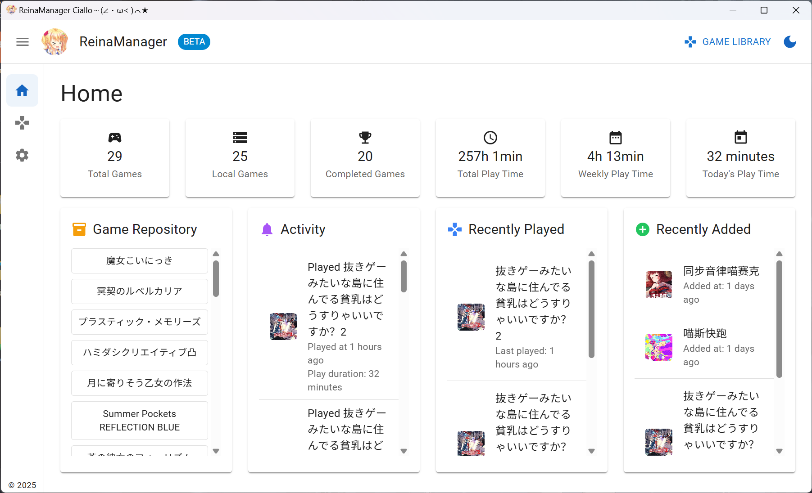
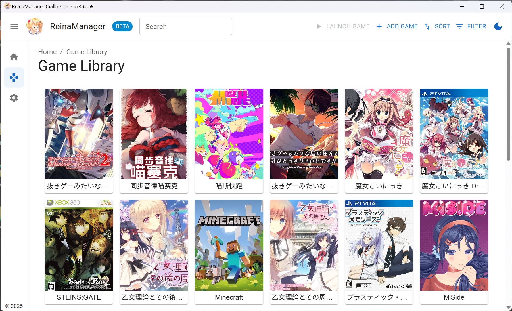
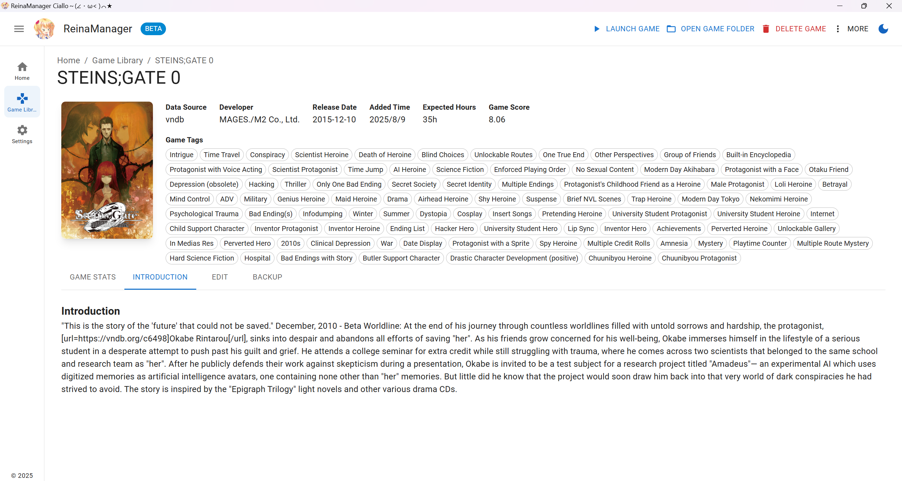
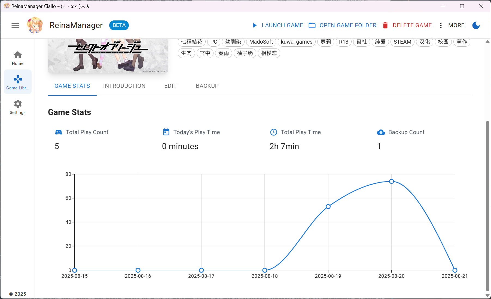
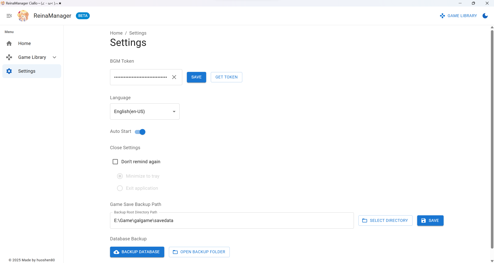

  

    
  

<h1>ReinaManager</h1>

  

English|<a href="./README.zh_CN.md">中文</a>|<a href="./README.zh_TW.md">繁體中文</a>|<a href="./README.ja_JP.md">日本語</a>

<h5>A lightweight visual novel manager,Under development...</h5>

The `Reina` in the name is the character <a href="https://vndb.org/c64303"><b>妃 玲奈(Kisaki Reina)</b></a> from game <a href="https://vndb.org/v21852"><b>金色ラブリッチェ(Kin'iro Loveriche)</b></a>

## Stacks

- Tauri 2.0

- React

- Material UI

- UnoCSS

- Zustand

- Sqlite

- Rust

## Todo

- [x] Add exe to Launch games
- [x] Open the local game folder
- [x] Home page functions
- [x] Add VNDB api to search games
- [x] I18n support
- [ ] Custom data of games
- [x] Count the time spent playing
- [ ] Beautify individual pages
- [x] Design the detail page
- [x] Refactor database queries
- [x] Add mixed api to search games
- [x] Edit page functions
- [x] Auto backup function
- [ ] Sync games status with Bangumi
- [ ] Bulk import games
- [ ] Tool: migrate whitecloud data into reinaManager
- [ ] Add hide NSFW filter

## Demo
##### Frontend Demo
- Try the web version: [https://reina.huoshen80.top](https://reina.huoshen80.top)
- The web version is not fully functional yet, but you can view the UI and some features.

##### Desktop App Demo

For more, you can download the latest Release Version: [Download](https://github.com/huoshen80/ReinaManager/releases)

## License

This project is licensed under the [AGPL-3.0 license](https://github.com/huoshen80/ReinaManager#AGPL-3.0-1-ov-file)

## Star History

