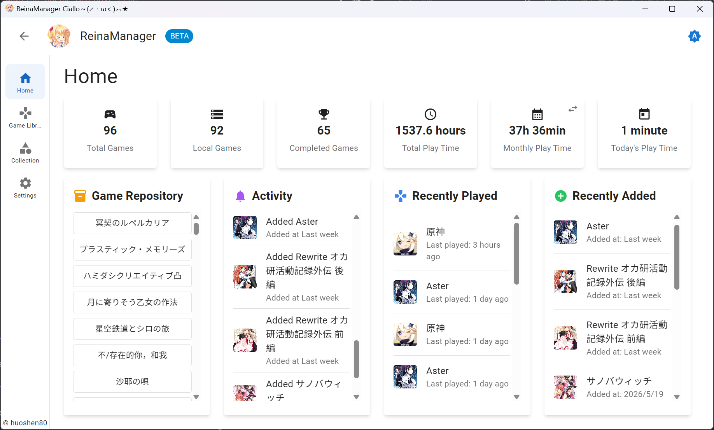
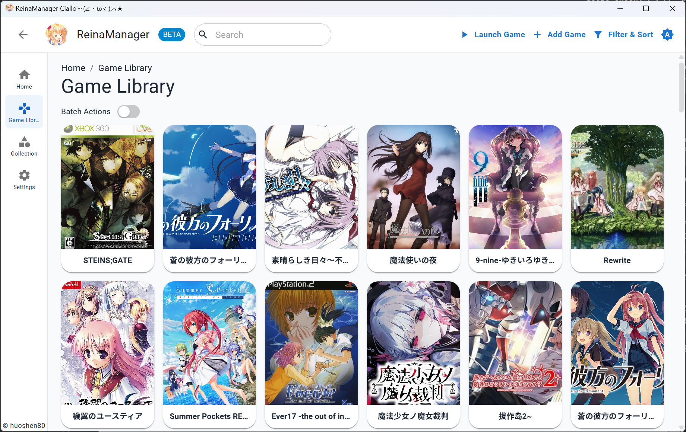
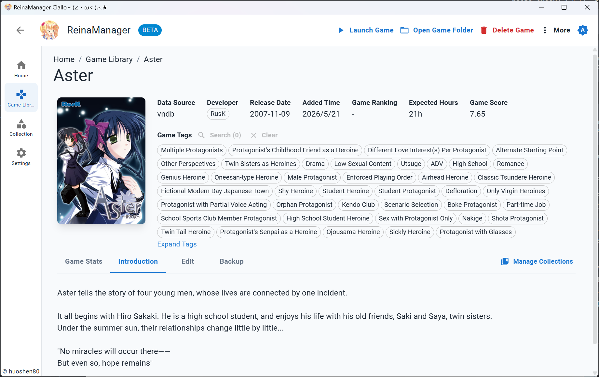
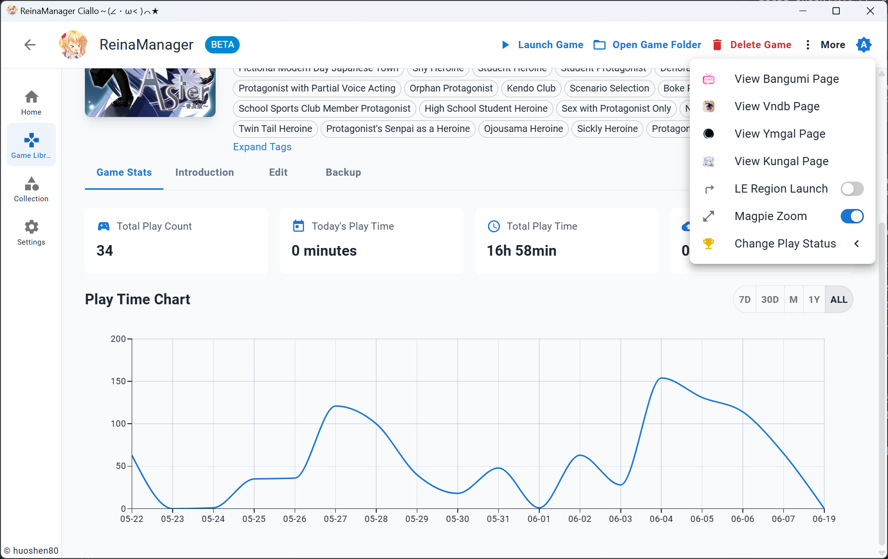
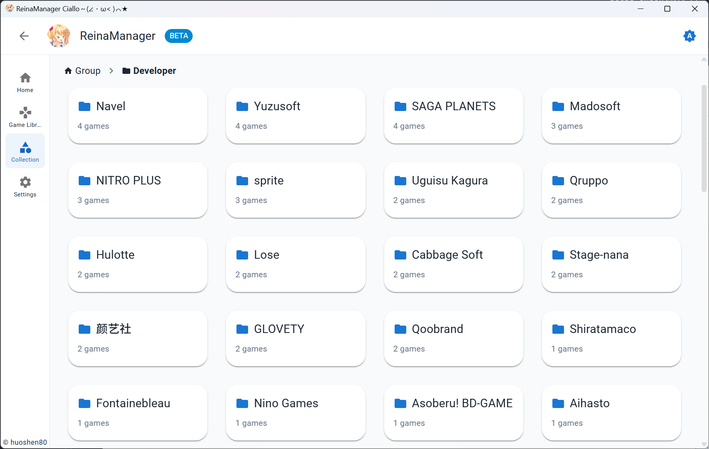

<div align="center">
  <div style="width:200px">
    <a href="https://vndb.org/c64303">
      
    </a>
  </div>

<h1>ReinaManager</h1>

    

[](https://wakatime.com/badge/user/36a51c62-bf3b-4b81-9993-0e5b0e7ed309/project/efb3bd00-20c2-40de-98b6-e2f4a24bc120)

开发时间统计自 v0.9.0 版本起

<p align="center"><a href="./README.md">English</a>|中文|<a href="./README.zh_TW.md">繁體中文</a>|<a href="./README.ja_JP.md">日本語</a></p>

<h5>一个轻量级的galgame/视觉小说管理工具，正在开发中...</h5>

名称中的 `Reina` 来源于游戏 <a href="https://vndb.org/v21852"><b>金色ラブリッチェ(Kin'iro Loveriche)</b></a> 中的角色 <a href="https://vndb.org/c64303"><b>妃 玲奈(Kisaki Reina)</b></a>

</div>

## 技术栈

- Tauri 2.0

- React

- Material UI

- UnoCSS

- Zustand

- TanStack Query

- Sqlite

- Rust

- SeaORM

## 功能特性

- 🌐 **多源数据整合** - 无缝获取并合并来自 VNDB、Bangumi、YmGal 和 Kungal API 的游戏元数据
- 🔍 **强大的搜索** - 通过游戏标题、别名、自定义名称及其他信息快速搜索游戏
- 🗂️ **筛选排序** - 对游戏进行多维度的筛选和排序，如按来源、状态、标签等
- 📚 **收藏管理** - 通过分组和分类组织游戏库，并支持拖拽排序
- 🎮 **游戏时长追踪** - 自动记录游戏会话，提供详细的游玩时间统计和历史记录
- 🎨 **个性化定制** - 支持自定义游戏封面、名称、简介、标签等信息，打造专属游戏库
- 🔄 **批量操作** - 支持从 API 批量导入、添加和更新游戏元数据
- 🌍 **多语言支持** - 提供完整的国际化支持，包含简体中文、繁体中文、英文、日文等语言
- 🔒 **NSFW 过滤** - 通过简单的开关隐藏或遮盖 NSFW 内容
- 💾 **自动存档备份** - 可选的自动备份功能，保护您的游戏存档
- 🚀 **系统集成** - 开机自启动和最小化到系统托盘
- 🛠️ **工具集成** - 启动游戏可联动 Locale Emulator 转区和 Magpie 放大

## 待办事项

- [x] 从文件夹批量导入游戏
- [x] 对 Linux 平台的基础支持 
- [x] 与 Bangumi 和 VNDB 同步游戏状态
- [ ] 美化各个页面

## 迁移

需要从其他 galgame/视觉小说管理器迁移数据？请查看 [reina_migrator](https://github.com/huoshen80/reina_migrator) - 一个用于将其他管理器数据迁移到 ReinaManager 的工具。

当前支持：
- **WhiteCloud v0.4.0** 数据迁移

该迁移工具可帮助您无缝转移游戏库、游玩时间记录和其他数据到 ReinaManager。

## 截图







更多内容，你可以下载最新的发布版本：[下载](https://github.com/huoshen80/ReinaManager/releases)

## 贡献
##### 开始
欢迎任何形式的贡献！如果你有改进建议、发现了 bug，或希望提交 Pull Request，请按照以下步骤操作：

1. Fork 本仓库，并从 `main` 分支创建新分支。
2. 如果修复了 bug 或新增了功能，请尽量进行相应测试。
3. 保证代码风格与现有代码一致，并通过所有检查。
4. 提交 Pull Request，并清晰描述你的更改内容。

##### 本地构建与运行项目
1. 确保你已安装 [Node.js](https://nodejs.org/) 和 [Rust](https://www.rust-lang.org/)。
2. 克隆仓库：
   ```bash
   git clone https://github.com/huoshen80/ReinaManager.git
   cd ReinaManager
   ```
3. 安装依赖：
   ```bash
   pnpm install
   ```
4. 运行开发服务器：
   ```bash
   pnpm tauri dev
   ```
5. 构建生产版本：
   ```bash
   pnpm tauri build
   ```

感谢你为 ReinaManager 做出的所有贡献！

## 赞助
如果你觉得这个项目好用，并希望支持项目的开发，可以考虑赞助。非常感谢每个支持者！
- [Sponsor link](https://cdn.huoshen80.top/233.html)

## 数据源

- **[Bangumi](https://bangumi.tv/)** - Bangumi 番组计划

- **[VNDB](https://vndb.org/)** - 视觉小说数据库

- **[Ymgal](https://www.ymgal.games/)** - 月幕Galgame

- **[Kungal](https://www.kungal.com/)** - 鲲 Galgame

特别感谢这些平台提供的公共 API 和数据！

## 许可证

本项目采用 [AGPL-3.0 许可证](https://github.com/huoshen80/ReinaManager#AGPL-3.0-1-ov-file)

## Star 历史

<a href="https://www.star-history.com/?repos=huoshen80%2FReinaManager&type=date&legend=top-left">
 <picture>
   <source media="(prefers-color-scheme: dark)" srcset="https://api.star-history.com/chart?repos=huoshen80/ReinaManager&type=date&theme=dark&legend=top-left&sealed_token=8hJwvRzfF7BXsrTDsmX91vlKMmh-OU782v2ckuiCUm8XJc8v4vPWELSEqWkvVUZQhWnPygevDuNNJesLHwTVfm61OTlK0coF2jHWtmBIpC6kFrYHIVv6G5bHXVR0PkVEMtWasv4ybAZvIPPkGeSRZsopqmZoDStENlqvrCZxvxa4p3mkV99cA1ndh02b" />
   <source media="(prefers-color-scheme: light)" srcset="https://api.star-history.com/chart?repos=huoshen80/ReinaManager&type=date&legend=top-left&sealed_token=8hJwvRzfF7BXsrTDsmX91vlKMmh-OU782v2ckuiCUm8XJc8v4vPWELSEqWkvVUZQhWnPygevDuNNJesLHwTVfm61OTlK0coF2jHWtmBIpC6kFrYHIVv6G5bHXVR0PkVEMtWasv4ybAZvIPPkGeSRZsopqmZoDStENlqvrCZxvxa4p3mkV99cA1ndh02b" />
   
 </picture>
</a>
